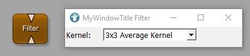

# Example 1: Panel for the contour filter
This example contains a whole package structure. Inside you can find the example contour filter for which a panel was created.

# Download
You can download the example network [here](./MyPackageGroup.zip)
