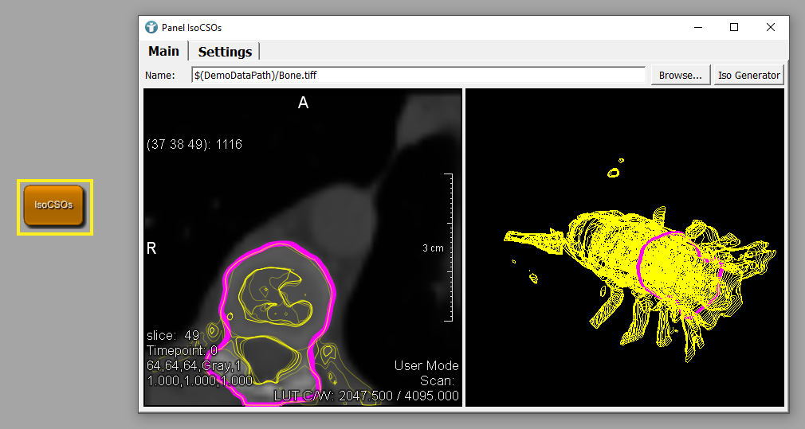

# Example 2: Python scripting
This example shows how to create module interactions via Python scripting.

# Download
The files need to be added to a package. You can download the example network [here](./ScriptingExample2.zip)
