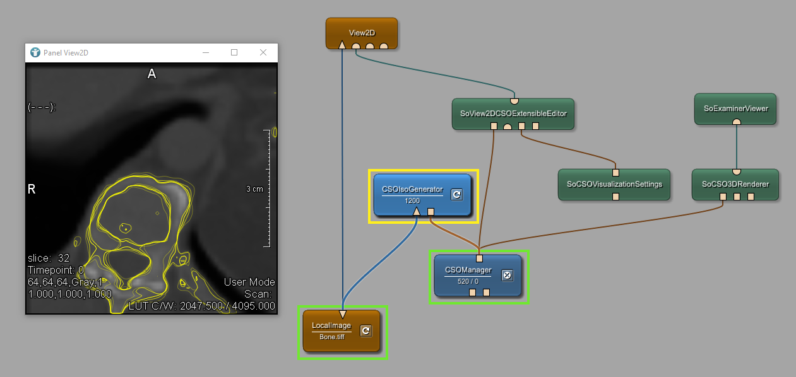

# Contour Example 5: Contours and ghosting
This image shows how to automatically create CSOs based on an iso value. In addition the visualization of CSOs of previous and subsequent slices is shown.

# Download
You can download the example network [here](./ContourExample5.mlab)
