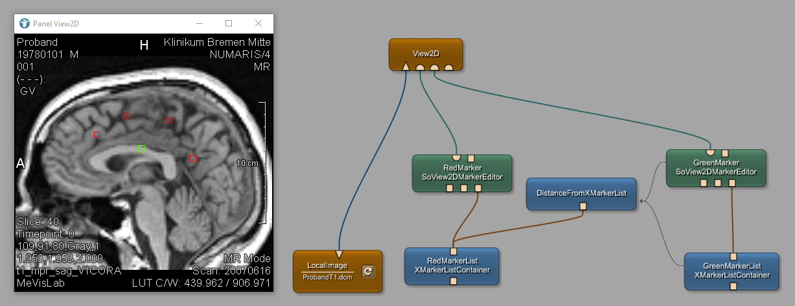

# Marker Example 1: Distance between markers
This examples shows how to create markers in a viewer and measure their distance.

# Download
You can download the example network [here](./VisualizationExample2.mlab)
