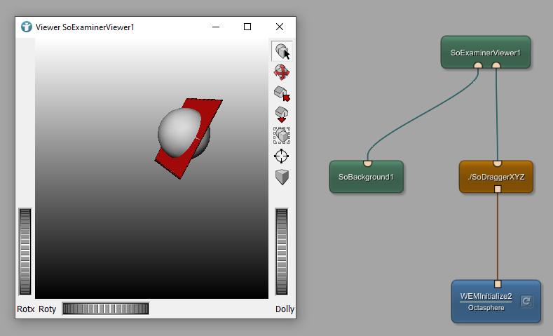

# Surface Example 4: Interactively moving WEM
This example shows how to use dragger modules, to modify objects in a 3D viewer.

# Download
You can download the example network [here](./SurfaceExample4.zip)
