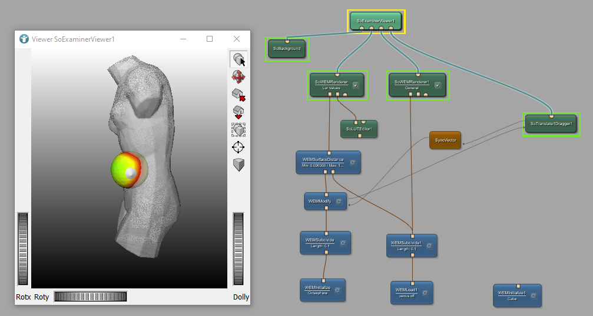

# Surface Example 5: WEM - Primitive Value Lists
This example shows how to use Primitive Value Lists (PVLs). With the help of PVLs the distance between the surfaces of WEMs is color coded.

# Download
You can download the example network [here](./SurfaceExample5.mlab)
