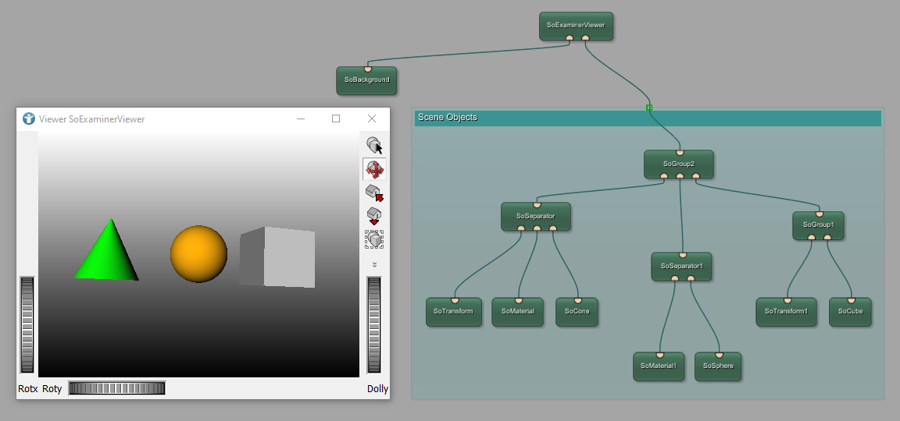

# Open Inventor Example 1: Open Inventor objects
In this example a simple Open Inventor scene is created. The Open Inventor scene shows three objects of different color and shape.

# Download
You can download the example network [here](./OpenInventorExample1.mlab)
