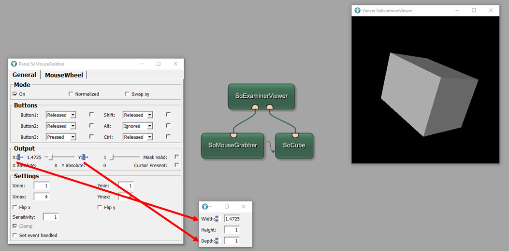

# Open Inventor Example 2: Mouse interactions in an Open Inventor scene
This example shows how to implement object interactions.

# Download
You can download the example network [here](./OpenInventorExample2.mlab)

