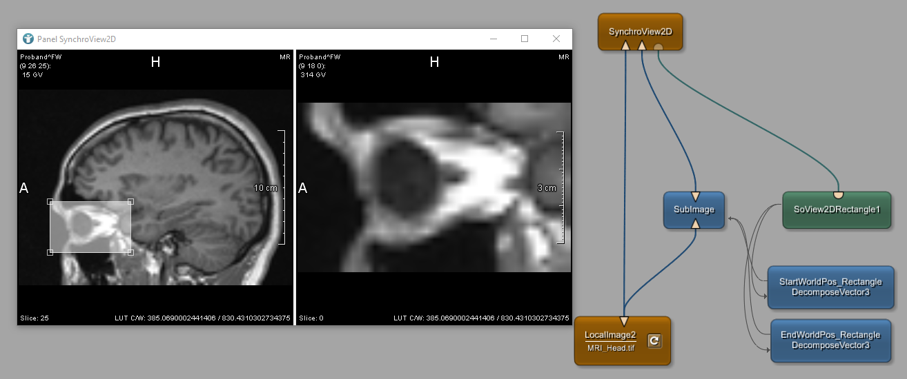

# Visualization Example 2: Creating a magnifier
This example shows how to create a magnifier. Using the module `SubImage` a fraction of the original image can be extracted and enlarged.

# Download
You can download the example network [here](./VisualizationExample2.mlab)
