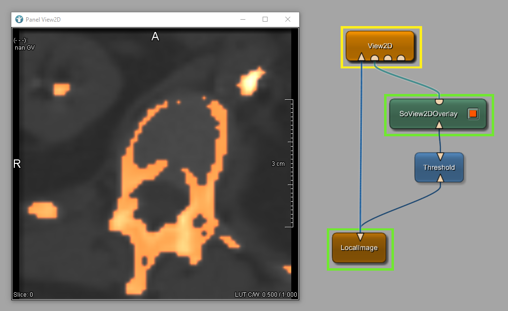

# Visualization Example 3: Image overlays
This example shows the creation of an overlay. Using the module `SoView2DOverlay`, an overlay can be blended over a 2D image.

# Download
You can download the example network [here](./VisualizationExample3.mlab)
